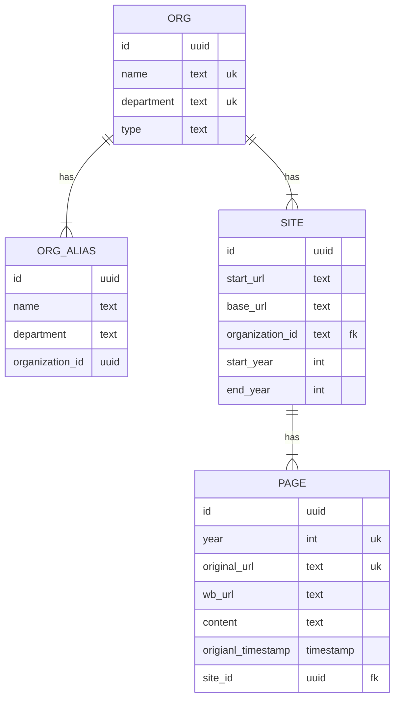

# CRU Scrape

This project is the first step in an initiative to analyze website content of Cooperative Research Units (CRUs) to measure how public messaging has changed. We use the [Wayback Machine](https://web.archive.org/) to crawl snapshots of websites, extract text content, and push it to a central Postgres database in preparation for future analysis.

Organizations that are currently tracked are listed here: https://github.com/MrDiggles2/cru-scrape/blob/main/src/scripts/organizations.tsv

## Getting Started

### Pre-reqs

* [Poetry](https://python-poetry.org/)
* [Docker](https://www.docker.com/)
* Git

### Installation

```bash
# Create copy of .env for local development
cp .env.example .env

# Start docker containers
docker compose up --wait

# Install python dependencies
poetry install
```

### Running the code

#### Seeding organization data

```bash
# Seed organization data
poetry run main seed-organizations

# Navigate to http://localhost:8080 to see tables populated
```

#### Scraping sites and dump content to stdout

You must run the seed procedure above and grab one of the site IDs in the DB

```bash
poetry run main crawl 2002 <SITE_ID>
```

#### Scraping sites and push content to DB

```bash
poetry run main crawl 2002 <SITE_ID> --push
```

#### Scraping a site by URL and dump content to stdout

```bash
poetry run main scrape-one-url https://web.archive.org/web/20010604010635/http://janus.state.me.us/ifw/index.htm
```

## Useful commands

### Destroy database
```
docker compose down --volumes
```

### Install Poetry (if you don't have it)
To check if you have it run
```
which poetry
```
To install poetry run
```
curl -sSL https://install.python-poetry.org | python3 -
```

Don't forget to add the poetry path to your bashrc, it will give you the export command at the end of the install logs

#### How to uninstall if you want
```
curl -sSL https://install.python-poetry.org | python3 - --uninstall
```

### Install dependencies

Run this, it should create the virtual environment for you at the same time
```
poetry install
```

### How to add libraries
```
poetry add <library name>
```

## ER Diagram


