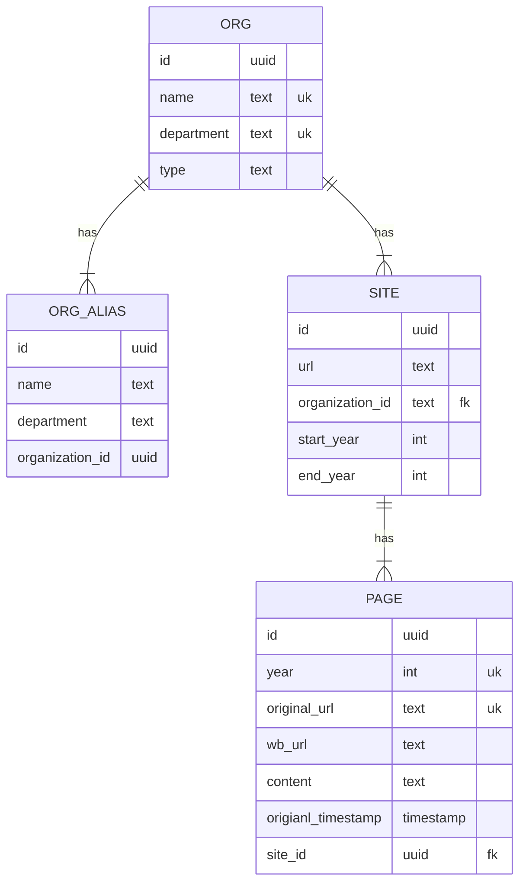

# CRU Scrape

## Getting Started

### Install Poetry (if you don't have it)
To check if you have it run
```
which poetry
```
To install poetry run
```
curl -sSL https://install.python-poetry.org | python3 -
```

Don't forget to add the poetry path to your bashrc, it will give you the export command at the end of the install logs

#### How to uninstall if you want
```
curl -sSL https://install.python-poetry.org | python3 - --uninstall
```

### Install dependencies

Run this, it should create the virtual environment for you at the same time
```
poetry install
```

### How to add libraries
```
poetry add <library name>
```

### Run the code

#### Scraping sites
```
cd src
poetry run python main.py <year> <base_url>

# example
poetry run python main.py 2002 "https://www.maine.gov/ifw/"
```

#### Uploading results

```
cp .env.example .env
# Fill in values in .env

cd src
# Rename the .ndjson file inside upload.py
poetry run python upload.py
```

## ER Diagram

