# CRU Scrape

## Getting Started

### Pre-reqs

* [Poetry](https://python-poetry.org/)
* [Docker](https://www.docker.com/)
* Git

### Installation

```bash
# Create copy of .env for local development
cp .env.example .env

# Start docker containers
docker compose up --wait

# Install python dependencies
poetry install
```

### Running the code

#### Seeding organization data

```bash
# Seed organization data
poetry run python src/scripts/upload-organizations.py

# Navigate to http://localhost:8080 to see tables populated
```

#### Scraping sites

```bash
poetry run python src/main.py 2002 "https://www.maine.gov/ifw/"

# Gets outputted to ./output
```

#### Uploading results

```bash
cd src
# Rename the .ndjson file inside upload.py
poetry run python upload.py
```

## Useful commands

### Destroy database
```
docker compose down --volumes
```

### Install Poetry (if you don't have it)
To check if you have it run
```
which poetry
```
To install poetry run
```
curl -sSL https://install.python-poetry.org | python3 -
```

Don't forget to add the poetry path to your bashrc, it will give you the export command at the end of the install logs

#### How to uninstall if you want
```
curl -sSL https://install.python-poetry.org | python3 - --uninstall
```

### Install dependencies

Run this, it should create the virtual environment for you at the same time
```
poetry install
```

### How to add libraries
```
poetry add <library name>
```

## ER Diagram

```mermaid
erDiagram
  ORG {
    id uuid
    name text uk
    department text uk
    type text
  }
  
  ORG_ALIAS {
  	id uuid
  	name text
		department text
		organization_id uuid
  }

  SITE {
    id uuid
    start_url text
    base_url text
    organization_id text fk
    start_year int
    end_year int
  }

  PAGE {
    id uuid
    year int uk
    original_url text uk
    wb_url text
    content text
    origianl_timestamp timestamp
    site_id uuid fk
  }
  
  ORG ||--|{ SITE: has
  ORG ||--|{ ORG_ALIAS: has
  SITE ||--|{ PAGE: has
```

